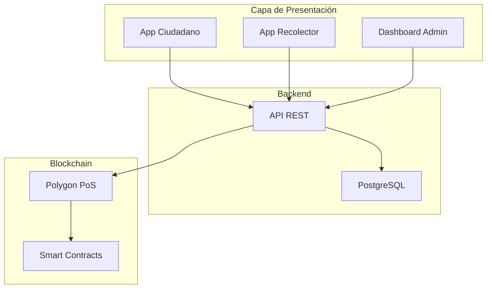

# 🌱 ReciTlax - Sistema de Incentivos Blockchain para Reciclaje


## Descripción

**ReciTlax** es una plataforma tecnológica basada en blockchain diseñada para incentivar económicamente a los ciudadanos de Tlaxiaco, Oaxaca, México, a clasificar correctamente sus residuos sólidos urbanos. El sistema utiliza smart contracts en Polygon para otorgar puntos (RecitCoins) que pueden canjearse por recompensas tangibles.

### Problema que Resuelve

Actualmente en Tlaxiaco:
- **0%** de los residuos se reciclan (todo va mezclado al relleno sanitario)
- Los ciudadanos **pagan $10-50 pesos** por recolección sin incentivos
- Materiales reciclables con valor de **~$1.5M MXN/año** se desperdician
- Zonas periféricas **queman basura** o la arrojan a ríos
- Trabajadores de recolección expuestos a **materiales peligrosos** sin clasificar

### Solución

ReciTlax crea un **ciclo virtuoso de incentivos:**
```
Ciudadano clasifica basura → Recolector verifica → Sistema otorga puntos (blockchain)
→ Ciudadano canjea puntos → Recibe descuentos/efectivo → Motivación para seguir reciclando
```

**Beneficios medibles:**
- **Ambiental:** 400+ toneladas recicladas/año, 600 ton CO2 evitadas
- **Económico:** $1.1M-1.6M MXN/año en materiales recuperados
- **Social:** $100-300 pesos/mes extra por hogar participante
- **Institucional:** Transparencia total vía blockchain público

---

## Arquitectura del Sistema

### Stack Tecnológico

**Frontend:**
- **App Móvil:** React Native (Android & iOS)
- **Dashboard Web:** Next.js + TypeScript

**Backend:**
- **API:** Node.js + Express
- **Base de Datos:** PostgreSQL
- **Almacenamiento:** IPFS (fotos/evidencias)

**Blockchain:**
- **Red:** Polygon PoS (capa 2 de Ethereum)
- **Smart Contracts:** Solidity
- **Tokens:** ERC-20 (RecitCoin)

**Servicios Externos:**
- Bitso API (conversión cripto-fiat)
- Twilio (SMS/verificación)
- Firebase Cloud Messaging (notificaciones push)

### Diagrama de Arquitectura


---

## Objetivos de Desarrollo Sostenible (ODS)

Este proyecto contribuye directamente a:

| ODS | Meta | Impacto Esperado |
|-----|------|------------------|
| **ODS 11** | Ciudades y Comunidades Sostenibles | Reducción del 20% de residuos en relleno sanitario |
| **ODS 12** | Producción y Consumo Responsables | 400+ toneladas recicladas año 1 |
| **ODS 13** | Acción por el Clima | 600 ton CO2eq evitadas anualmente |

**ODS Secundarios:** 3 (Salud), 6 (Agua limpia), 8 (Trabajo decente), 10 (Reducción de desigualdades)

---

## Características Principales

### Para Ciudadanos
- Registro con verificación de identidad (INE + CURP)
- Código QR único por hogar
- Consulta de saldo en tiempo real
- Catálogo de recompensas (descuentos, efectivo, servicios)
- Tutorial interactivo de clasificación
- Historial de recolecciones
- Ranking comunitario (gamificación)

### Para Recolectores
- Verificación de clasificación con evidencia fotográfica
- Rutas optimizadas
- Estimación de peso de reciclables
- Dashboard de eficiencia

### Para Administración Municipal
- Métricas en tiempo real
- Reportes semanales automatizados (Excel)
- Gestión de usuarios y roles
- Configuración de parámetros del sistema
- Auditoría de transacciones blockchain
- Control de presupuesto de recompensas

---

## Modelo de Funcionamiento

### Sistema de Puntos

| Acción | Puntos Otorgados |
|--------|------------------|
| Clasificación correcta | 10 pts base |
| Por cada kg de PET | +2 pts |
| Por cada kg de cartón | +1 pt |
| Por cada kg de aluminio | +5 pts |
| Racha de 4 semanas | +20 pts bonus |
| Mes perfecto | +50 pts bonus |

**Equivalencia:** 2 puntos = 1 peso mexicano

### Recompensas Disponibles

- **Efectivo:** Desde 50 pts ($25 MXN)
- **Descuentos en comercios:** Alianzas locales
- **Servicios municipales:** Descuento en agua, predial
- **Productos:** Despensas, artículos de primera necesidad

### Penalizaciones

- Basura mal clasificada: **$15 pesos** + rechazo sin puntos
- El ciudadano puede **apelar** en 48 horas

---

## Estructura del Repositorio
```
recitlax/
├── README.md                          # Este archivo
├── docs/
│   ├── DRS.md                        # Documento de Requisitos del Sistema
│   ├── REQUISITOS-FUNCIONALES-DETALLADOS.md
│   ├── MANUAL-USUARIO.md
│   └── GUIA-IMPLEMENTACION.md
├── contracts/                         # Smart Contracts Solidity
│   ├── RecitCoinToken.sol
│   ├── RecyclingRegistry.sol
│   └── RewardMarketplace.sol
├── backend/                           # API Node.js
│   ├── src/
│   ├── tests/
│   └── package.json
├── mobile/                            # App React Native
│   ├── src/
│   └── package.json
├── dashboard/                         # Dashboard Next.js
│   ├── src/
│   └── package.json
└── deployment/                        # Scripts de deployment
    ├── docker-compose.yml
    └── kubernetes/
```

---

## Instalación y Configuración

> **Nota:** El proyecto está actualmente en fase de diseño. Esta sección se actualizará cuando el desarrollo comience.

### Requisitos Previos
- Node.js 18+
- PostgreSQL 14+
- Cuenta en Polygon (para deployment de contratos)
- Claves API: Bitso, Twilio, Firebase

### Instalación (Futura)
```bash
# Clonar repositorio
git clone https://github.com/[usuario]/recitlax.git
cd recitlax

# Instalar dependencias
npm install

# Configurar variables de entorno
cp .env.example .env

# Iniciar servicios
docker-compose up -d
```

---

## Roadmap del Proyecto

### Fase 1: Diseño (Completada)
- [x] Documento de Requisitos del Sistema (DRS)
- [x] Diagramas UML (casos de uso, secuencia, clases)
- [x] Arquitectura blockchain
- [x] Modelo económico

### Fase 2: Desarrollo (3-4 meses)
- [ ] Smart contracts en Solidity
- [ ] Backend API
- [ ] App móvil ciudadano
- [ ] App móvil recolector
- [ ] Dashboard administrativo

### Fase 3: Piloto (2-3 meses)
- [ ] Deployment en testnet (Polygon Mumbai)
- [ ] Pruebas con 200 hogares en 1 colonia
- [ ] Ajustes basados en feedback
- [ ] Auditoría de seguridad de contratos

### Fase 4: Producción (Año 1)
- [ ] Deployment en mainnet
- [ ] Expansión a 4,000 hogares
- [ ] Establecer 2 puntos de acopio
- [ ] Alianzas con 15+ comercios locales

---

## Contribuciones

Este proyecto está en fase inicial. Las contribuciones serán bienvenidas una vez que el desarrollo comience.

### Cómo Contribuir (Futuro)
1. Fork el repositorio
2. Crea una rama (`git checkout -b feature/nueva-funcionalidad`)
3. Commit tus cambios (`git commit -m 'Agregar nueva funcionalidad'`)
4. Push a la rama (`git push origin feature/nueva-funcionalidad`)
5. Abre un Pull Request

---

## Licencia

[Pendiente de definir]

---

## Equipo

**Desarrollador Principal:**
- Lizeth Nallely López García
- Yeni Daniela Ojeda Gómez 

**Colaboradores:**
- H. Ayuntamiento de Tlaxiaco, Oaxaca
- Dirección de Ecología Municipal

---
